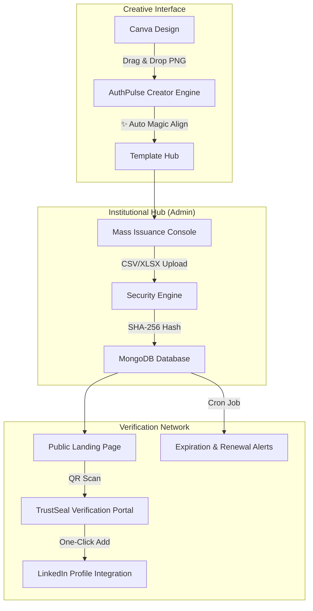

# AuthPulse: Professional Credentialing & Verification Ecosystem


**AuthPulse** is a first-of-its-kind, high-fidelity credentialing platform that brings Canva-level design flexibility to institutional automated verification. It protects organizations from credential fraud while providing an elite user experience for both administrators and students.

---

## 🏗️ System Architecture



---

## 🚀 Key Modules & Functions

### 🎨 1. The Creator Engine (Canva Bridge)
Our visual design studio provides a seamless bridge from premium design tools like Canva into our automated engine.
- **Drag & Drop UI**: Simply drag your custom PNG designs from your computer directly into the web browser.
- **✨ Auto Magic Align**: No more tedious dragging. Click the Magic Align button to instantly and smartly distribute required fields (Name, Date, Signatures) perfectly across your canvas using local heuristics.
- **Dynamic Variable Mapping**: Drag and drop automated tokens like `{{studentName}}` onto any pixel of your custom background.
- **A4 Stabilization**: Enforced 1.414:1 aspect ratio ensures your design never offsets.

### 🛡️ 2. Security & Blockchain-Inspired Cryptography
Tamper-proofing is at the core of the ecosystem.
- **SHA-256 Cryptographic Hashing**: Every certificate generates a unique cryptographic hash based on its payload (Student Name, ID, Domain, Dates). Any alteration to the data breaks the hash, ensuring immutable verification similar to blockchain concepts.
- **TrustSeal QR**: Instant mobile-first verification. Scanning the QR code bypasses manual lookups and goes straight to the digital source of truth.
- **Revocation Manager**: Instantly invalidate a certificate if an error is found or a program is incomplete. The public portal will instantly flag it as Revoked.
- **Data Segregation**: Strict multi-tenant backend architecture. Organization A's assets, logos, and certificates are strictly segregated from Organization B's.

### ⏱️ 3. Dynamic Expiration & Renewal Lifecycle
Certificates are living documents.
- **Expiration Tracking**: Assign expiration dates (`expiresAt`) to credentials (e.g., CPR training, AWS Certs) directly through the CSV upload.
- **Automated Cron Jobs**: A secure `node-cron` background task runs every night at midnight, searching for certificates exactly 7 days away from expiration.
- **Automated Notifications**: Sends a fully branded warning email to the student with instructions to contact your organization to renew.

### 🔗 4. Verification & LinkedIn Integration
- **LinkedIn One-Click**: Students can add their verified credential directly to their LinkedIn profile with a single click. AuthPulse injects all rich metadata (Name, Organization, Issue Date, Expiration Date, and cryptographic URL) straight into LinkedIn's official API.
- **Institution Branding**: Custom organization seals and color palettes are baked into the security signature and all student emails.

---

## 🛠️ Technical Implementation

| Component | Technology | Role |
| :--- | :--- | :--- |
| **Frontend** | React 18 / Vite | High-performance sub-pixel rendering. |
| **Styling** | Vanilla CSS + Framer Motion | Fluid, premium animations and layouts. |
| **Backend** | Node.js / Express | Automation, APIs, and Cron tasks. |
| **Database** | MongoDB / Mongoose | Secure NoSQL data persistence and multi-tenancy. |
| **Security** | Crypto Node Module | Industry-standard SHA-256 implementation. |
| **Tasks** | Node-Cron | Background lifecycle management. |

---

## 📂 Project Structure

```bash
├── client/           # React + Vite Frontend
│   ├── src/
│   │   ├── components/  # Creator Engine, Dashboard, Verify Portal
│   │   └── App.jsx      # Main Hub Router
├── server/           # Node.js + Express Backend
│   ├── index.js         # Core Server & Middleware
│   ├── routes/          # API Controllers (Admin, Auth, Certificates)
│   ├── cron/            # Expiration Background Tasks
│   ├── models/          # MongoDB Schemas
│   └── public/          # Isolated Organization Storage
└── README.md
```

---

## 🏁 Quick Launch Guide

1. **Environment Setup**
   ```bash
   # Install frontend dependencies
   cd client && npm install
   
   # Install backend dependencies
   cd ../server && npm install
   ```

2. **Start the Engine**
   Ensure MongoDB is running locally or provide a `MONGO_URI` in `server/.env`.
   ```bash
   # Terminal 1: Backend
   cd server && npm run dev
   
   # Terminal 2: Frontend
   cd client && npm run dev
   ```

3. **Verification Testing**
   Search for your generated certificate ID on the landing page to witness the high-fidelity rendering, security hash, and LinkedIn integration in action.

---

**Built with Precision for Institutional Excellence.**  
*© 2026 AuthPulse | Developed by Vansh Jain*
