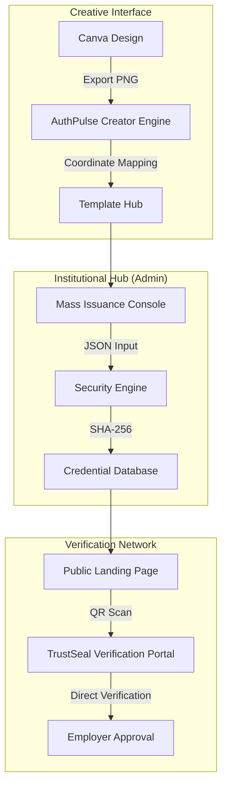

# AuthPulse: Professional Credentialing & Verification Ecosystem


**AuthPulse** is a first-of-its-kind, high-fidelity credentialing platform that brings Canva-level design flexibility to institutional automated verification. It protects organizations from credential fraud while providing an elite user experience for both administrators and students.

---

## 🏗️ System Architecture



---

## 🚀 Key Modules

### 🎨 1. The Creator Engine (Canva Bridge)
Our visual design studio provides a seamless bridge from premium design tools like Canva into our automated engine.
- **A4 Stabilization**: Enforced 1.414:1 aspect ratio ensures your design never offsets.
- **Layering System**: Pro-grade Z-index controls for overlapping logos, signatures, and seals.
- **Dynamic Variable Mapping**: Drag and drop automated tokens like `{{studentName}}` onto any pixel of your custom background.

### 🛡️ 2. Security & Integrity (SHA-256)
Tamper-proofing is at the core of the ecosystem.
- **Blockchain-Inspired Hashing**: Every certificate generates a unique cryptographic hash based on its payload.
- **TrustSeal QR**: Instant mobile-first verification. Scanning the QR code bypasses manual lookups and goes straight to the digital source of truth.
- **Institution Branding**: Custom organization seals and color palettes are baked into the security signature.

### 📊 3. Central Command Hub
Total control over the credential lifecycle.
- **Mass Issuance**: Upload hundreds of records via XLSX and issue in one click.
- **Revocation Manager**: Instantly invalidate a certificate if an error is found or a program is incomplete.
- **Live Analytics**: Track student demographics and internship domain distributions.

---

## 🛠️ Technical Implementation

| Component | Technology | Role |
| :--- | :--- | :--- |
| **Frontend** | React 18 / Vite | High-performance sub-pixel rendering. |
| **Styling** | Vanilla CSS + Framer Motion | Fluid, premium animations and layouts. |
| **Backend** | Node.js / Express | Automation and file management. |
| **Security** | Crypto-JS | Industry-standard SHA-256 implementation. |
| **Icons** | Lucide-React | Crisp, premium vector library. |

---

## 📂 Project Structure

```bash
├── client/           # React + Vite Frontend
│   ├── src/
│   │   ├── components/  # Creator Engine, Dashboard, Verify Portal
│   │   └── App.jsx      # Main Hub Router
├── server/           # Node.js + Express Backend
│   ├── db_handler.js    # Security & Persistence Manager
│   ├── public/assets    # Global Design Media Library
│   └── templates.json   # Dynamic Design Metadata
└── SYSTEM_DESIGN.md  # Detailed Architectural Specifications
```

---

## 🏁 Quick Launch Guide

1. **Environment Setup**
   ```bash
   cd client && npm install
   cd ../server && npm install
   ```

2. **Start the Engine**
   ```bash
   # Terminal 1: Backend
   cd server && npm start
   
   # Terminal 2: Frontend
   cd client && npm run dev
   ```

3. **Verification Testing**
   Search for `CERT-2024-001` on the landing page to witness the high-fidelity rendering and security hash in action.

---

**Built with Precision for Institutional Excellence.**  
*© 2026 AuthPulse| Developed by Vansh Jain*
