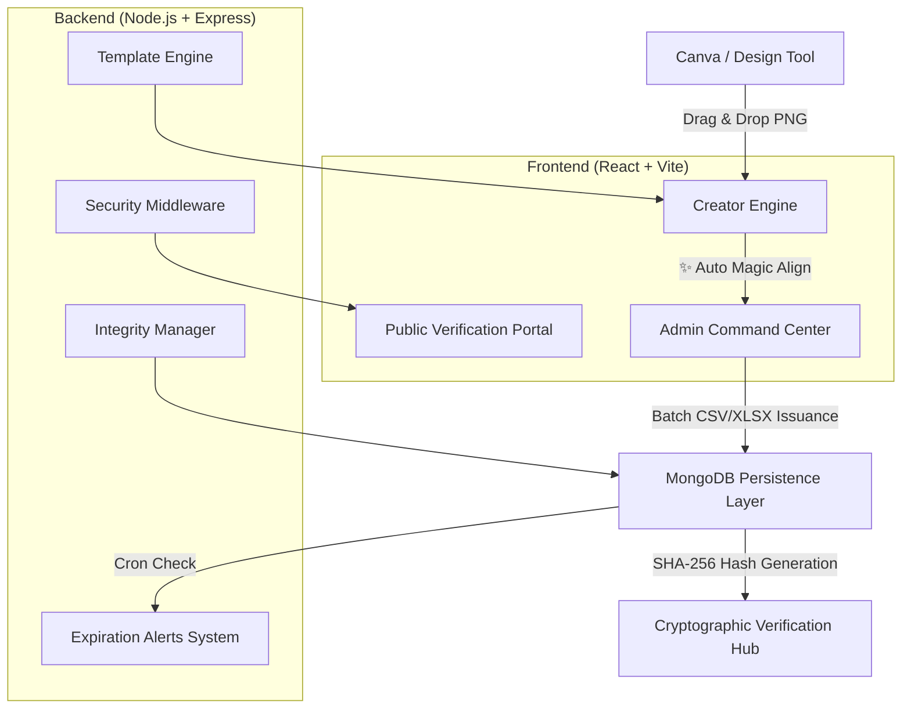
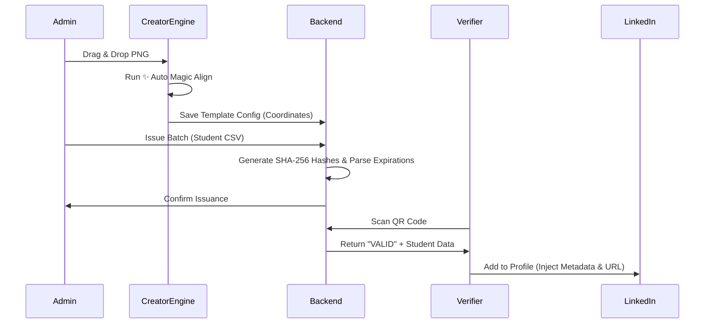

# AuthPulse: System Architectural Design

**Project Title**: Pro-Grade Credentialing & Blockchain-Inspired Verification Ecosystem  
**Author**: AuthPulse Engineering Team  
**Scope**: Institutional Automation, Fraud Protection, and Digital Design

---

## 1. Executive Summary
AuthPulse is a high-performance credentialing platform designed to eliminate credential fraud while providing world-class design flexibility. The system bridges the gap between premium design tools (like Canva) and automated verification systems (SHA-256 integrity checks). It features a "Creator Engine" for sub-pixel design precision, automated data alignment via local heuristics, dynamic expiration lifecycles, and a "TrustSeal" QR-based verification portal with LinkedIn integration.

---

## 2. High-Level Architecture

---

## 3. Core Modules

### 3.1 The Creator Engine (Canva Bridge)
Unlike standard PDF generators, AuthPulse uses a proprietary **A4-Standard Rendering Engine** that enforces a rigid 1.414:1 aspect ratio. 
- **Drag-and-Drop Ingestion**: Plugs directly into HTML5 APIs to instantly ingest background designs.
- **Auto Magic Align**: Smart heuristics automatically parse and distribute standard certificate variables perfectly across the canvas, avoiding tedious manual configurations.
- **Polymorphic Elements**: Supports Dynamic Variables (Student Data), Static Text (Signatures), and Image Assets (Logos/Seals).
- **Z-Index Layering**: Implements a CSS-Grid based coordinate system to ensure zero layout-shift across different screen resolutions.

### 3.2 Security & Cryptographic Layer
Every certificate is immutable once issued. The system employs:
- **SHA-256 Hashing**: A unique integrity hash is generated for every credential based on Student ID, Name, Domain, and Issue Date.
- **TrustSeal QR**: An automated QR code that leads directly to the verification page for that specific hash.
- **Status Management**: Real-time revocation/restoration capabilities for institutional control.

### 3.3 Dynamic Lifecycles & Verification
- **Expiration Cron Jobs**: A secure `node-cron` daemon continuously monitors credential validity. It auto-triggers personalized, branded warning emails to students exactly 7 days before their credential expires.
- **LinkedIn One-Click Integration**: The verification portal dynamically constructs a secure URL payload to push verified metadata (including expiration) directly into the student's LinkedIn profile.

### 3.4 Admin Command Center
- **Template Synchronization**: Bi-directional sync between the designer and the issuance engine.
- **Analytics Dashboard**: Granular metrics on mass-issued credentials and usage patterns.
- **Data Segregation**: Strict multi-tenant backend architecture isolates MongoDB records and file systems based on `organizationId`.

---

## 4. Technical Stack

| Category | Technology | Rationale |
| :--- | :--- | :--- |
| **Frontend** | React 18 (Vite) | High-speed HMR and component-based design. |
| **UI/UX** | Vanilla CSS + Framer Motion | Fluid transitions for the 'Creator Engine' experience. |
| **Backend** | Node.js (Express) | Asynchronous handling of file uploads and hash generation. |
| **Database** | MongoDB + Mongoose | Highly scalable NoSQL data persistence supporting complex multi-tenancy rules. |
| **Security** | Crypto Node Module | Industry-standard implementation of SHA-256. |
| **Automation**| Node-Cron | Reliable server-side scheduling for lifecycle emails. |

---

## 5. Sequence Diagram: Data Flow

---

**© 2026 AuthPulse Project | Developed for Academic & Institutional Excellence**
